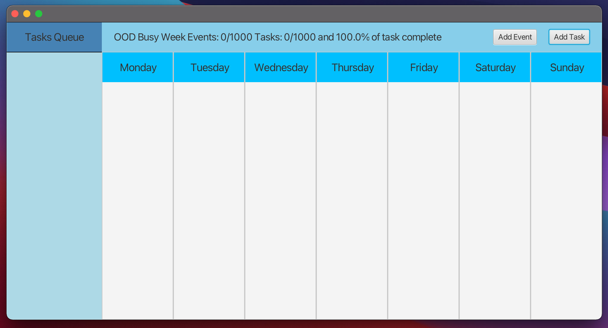

# CalendarApp
By PA05-fullstack (Shaan Patel, Armaan Agrawal & Tanmay Demble)

Welcome to the CalendarApp! This powerful tool helps you stay organized and manage your tasks and events efficiently. With a visually impressive and personalized GUI, you can unleash your creativity and make your journal a work of art. Let's dive into the features that make this application stand out:

**Week View**: Get a clear overview of your week with a spread that displays each day of the week horizontally. Customize the names of the days to suit your preference.

**Screenshot of GUI**

**Event and Task Creation**: Create new events and tasks effortlessly. Specify the name, description (optional), day of the week, start time, and duration for events. For tasks, set the name, description (optional), day of the week, and mark them as complete or incomplete. All details are displayed directly on the Week View for quick reference.

**Persistence**: Save your week's data to a .bujo file using JSON encoding. When you open the application, a default calendar will be opened but you may open a .bujo file to display its contents as your week view.

**Commitment Warnings**: Set maximum limits for events and tasks per week. If you exceed these limits, helpful warnings will be displayed on the GUI to ensure you stay on track.

**Task Queue**: Easily manage your tasks with the sidebar displaying all tasks for the week. Each task is accompanied by its name and completion status, allowing you to track progress effectively.

**Menu Bar & Shortcuts**: Access key features quickly through the menu bar or convenient keyboard shortcuts. Create new events with `cmd/ctrl + e`, new tasks with `cmd/ctrl + t`, save with `cmd/ctrl + s`, open a file with `cmd/ctrl + o`, and start a new week with `cmd/ctrl + n`.

**Mini Viewer**: Open any event or task in a new window for a detailed view simply by clicking on it. Review all aspects, including the day of the week.

**Weekly Overview**: Gain insights into your week with a statistics section. See the total number of events, tasks, and the percentage of completed tasks at a glance.

**Takesie-backsies**: Made a mistake? Don't worry, you can easily delete tasks and events with a discoverable feature. Deletions are reflected immediately on the GUI and saved in the .bujo file.

**Links**: If you include a valid HTTP/HTTPS link in an event or task description, it becomes clickable within the application. Seamlessly access external resources related to your commitments.

**Mind Changes**: Have the flexibility to edit any aspect of existing events or tasks directly from the Week View. Modify names, descriptions, and even day of the week effortlessly.

**Deployable Application**: We provide a deployable .jar file that contains all the functionality of your Bullet Journal. 

**Visual Flourish**: We've designed the GUI to be visually impressive, unique, and personalized. From customizable fonts, colors, borders, to icons, the journal expresses a very modern style.

**Splash Screen**: Upon launching the application, a beautiful welcome screen awaits you. It contains the name of the application along with the names of our developers. Us :) (Shaan Patel, Armaan Agrawal & Tanmay Demble) and a nice smooth moving progress bar

**Privacy Lock**: Keep your journal secure with a password. Before accessing the contents of any journal, you will be prompted to authenticate, ensuring your sensitive information remains private.

**Weekly Starters**: Open a .bujo file as a template to kickstart your new week. Customize the week's name and override the template if necessary. Previous events and tasks are not carried over, but all other preferences are retained. The new week is saved as a separate .bujo file without modifying the original template.

*Example*: Applying SOLID principles:
- **Single Responsibility Principle (SRP)**: Each class in the application has a single responsibility, ensuring that changes to one aspect do not affect unrelated components.
- **Open/Closed Principle (OCP)**: The application is designed to be open for extension but closed for modification. New features can be added without modifying existing code.
- **Liskov Substitution Principle (LSP)**: The application uses interfaces and abstractions to allow interchangeable components, ensuring that any subclass can be used in place of its parent class.
- **Interface Segregation Principle (ISP)**: Interfaces are kept small and focused, ensuring that clients are not forced to depend on methods they do not use.
- **Dependency Inversion Principle (DIP)**: The application follows the dependency inversion principle by depending on abstractions rather than concrete implementations, allowing for easier testing and flexibility in changing dependencies.

*Extending the program*: To add an additional feature, such as reminders or notifications, you could incorporate a notification system that alerts users about upcoming events or incomplete tasks. The notifications could be displayed within the application or sent to the user's preferred communication channel, such as email or mobile push notifications. This feature would enhance the proactive management of commitments and ensure timely completion.

